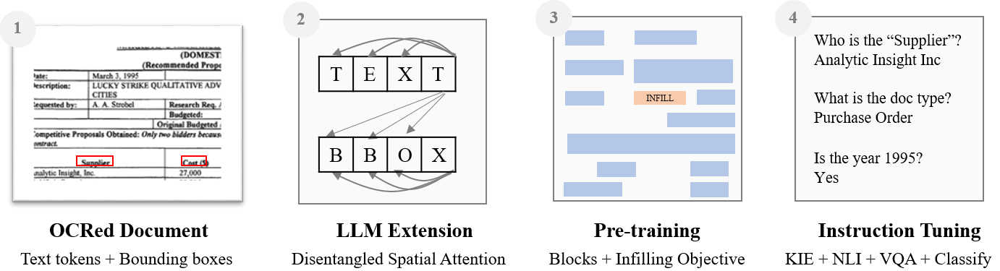

# DocLLM: A layout-aware generative language model for multimodal document understanding

Dongsheng Wang, Natraj Raman, Mathieu Sibue, Zhiqiang Ma, Petr Babkin, Simerjot Kaur, Yulong Pei, Armineh Nourbakhsh, Xiaomo Liu

[Paper Link](https://github.com/dswang2011/DocLLM/blob/main/DocLLLM_preprint.pdf) *(arxiv version is under review)*

## Introduction 

  

Enterprise documents such as forms, invoices, receipts, reports, contracts, and other similar records, often carry rich semantics at the intersection of textual and spatial modalities. The visual cues offered by their complex layouts play a crucial role in comprehending these documents effectively. In this paper, we present Docllm, a lightweight extension to traditional large language models (LLMs) for reasoning over visual documents, taking into account both textual semantics and spatial layout. Our model differs from existing multimodal LLMs by avoiding expensive image encoders and focuses exclusively on bounding box information to incorporate the spatial layout structure. Specifically, the cross-alignment between text and spatial modalities is captured by decomposing the attention mechanism in classical transformers to a set of disentangled matrices. Furthermore, we devise a pre-training objective that learns to infill text segments. This approach allows us to address irregular layouts and heterogeneous content frequently encountered in visual documents. The pre-trained model is fine-tuned using a large-scale instruction dataset, covering four core document intelligence tasks. We demonstrate that our solution outperforms SotA LLMs on 14 out of 16 datasets across all tasks, and generalizes well to 4 out of 5 previously unseen datasets.

## Main Results

We outperform SotA LLMs on 14 out of 16 datasets across all tasks with **DocLLM-7B**.

| Task         | Datasets         | GPT-4+OCR | Llama2+OCR | mPLUG-DocOwl | UReader | DocLLM-1B | DocLLM-7B |
|--------------|------------------|-----------|------------|--------------|---------|-----------|-----------|
| **VQA**      | DocVQA           | **82.8**  | 47.4       | 62.2         | 65.4    | 61.4      | 69.5      |
|              | WTQ (Accuracy)    | **65.4**  | 25.0       | 26.9         | 29.4    | 21.9      | 27.1      |
|              | VisualMRC (CIDEr) | 255.1     | 115.5      | 188.8        | 221.7   | 245.0     | **264.1** |
|              | DUDE              | **54.6**  | 38.1       | -            | -       | 42.6      | 47.2    |
|              | BizDocs           | 76.4      | 48.8       | -            | -       | 84.5      | **86.7**  |
| **NLI**      | TabFact           | **77.1**  | 48.2       | 60.2         | 67.6    | 58.0      | 66.4      |
| **KIE**      | KLC               | 45.9      | 27.8       | 30.3         | 32.8    | 58.9    | **60.3**  |
|              | CORD              | 58.3      | 13.8       | -            | -       | 66.9    | **67.4**  |
|              | FUNSD             | 37.0      | 17.8       | -            | -       | 48.2    | **51.8**  |
|              | DeepForm          | 42.1      | 20.5       | 42.6         | 49.5    | 71.3    | **75.7**  |
|              | PWC               | 18.3      | 6.8        | -            | -       | 25.7    | **29.1** |
|              | SROIE             | 90.6      | 56.4       | -            | -       | 91.0    | **91.9**  |
|              | VRDU a.-b.        | 43.7      | 18.7       | -            | -       | 87.6    | **88.8**  |
|              | BizDocs           | 66.1      | 10.8       | -            | -       | 95.4    | **95.9**  |
| **CLS**      | RVL-CDIP          | 68.2      | 32.8       | -            | -       | 90.9    | **91.8**  |
|              | BizDocs           | 84.9      | 40.9       | -            | -       | 98.3    | **99.4**  |

*Note: Values in bold represent the best performance in each row. Performance comparison in the SDDS setting against other multimodal and non-multimodal LLMs; non-multimodal LLMs are Zero-Shot (ZS) prompted while multimodal LLMs are instruction-tuned on the train split of the datasets considered. `-' marks not available. * Refer to paper for more details.

## Acknowledgments
This paper was prepared for information purposes by the [Artificial Intelligence Research group of JPMorgan Chase \& Co and its affiliates (“JP Morgan”)](https://www.jpmorgan.com/technology/artificial-intelligence), and is not a product of the Research Department of JP Morgan.  J.P. Morgan makes no representation and warranty whatsoever and disclaims all liability for the completeness, accuracy or reliability of the information contained herein. This document is not intended as investment research or investment advice, or a recommendation, offer or solicitation for the purchase or sale of any security, financial instrument, financial product or service, or to be used in any way for evaluating the merits of participating in any transaction, and shall not constitute a solicitation under any jurisdiction or to any person, if such solicitation under such jurisdiction or to such person would be unlawful. © 2023 JP Morgan Chase \& Co. All rights reserved.

## BibTeX citation:
@misc{2023,
      title={DocLLM: A Layout-Aware Generative Language Model for Multimodal Document Understanding}, 
      author={Dongsheng Wang, Natraj Raman, Mathieu Sibue, Zhiqiang Ma, Petr Babkin, Simerjot Kaur, Yulong Pei, Armineh Nourbakhsh, Xiaomo Liu},
      year={2023},
      Month={December},
      institute={JPMorgan AI Research}
}

short link: http://bit.ly/jpm-docllm
